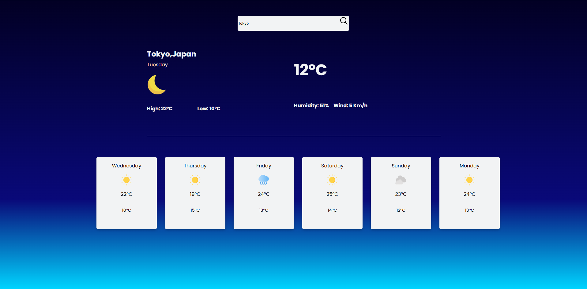

# Weather Site 🌤️

A simple weather web application that fetches real-time weather data based on the city input. Built with HTML, CSS, and JavaScript, and powered by the [Open-Meteo API](https://open-meteo.com/).

## 🚀 Features

- 🔍 Search weather by city name
- 🌡️ Displays temperature, weather condition, and wind speed
- 💧 6 days forecast
- ⚙️ Error handling for invalid inputs or API issues

## 🛠️ Technologies Used

- HTML5
- CSS3
- JavaScript (Vanilla)
- [Open-Meteo API](https://open-meteo.com/)

## 📷 Screenshots




## 💻 How to Run Locally

1. Clone the repository:
   ```bash
   git clone https://github.com/mateussombrio/weather-site.git

2. Navigate to the project directory:
    ```bash
    cd weather-site

3. Open the **index.html** file in your browser:
- Just double-click the file
- Or use the VSCode **Live Server** extension

## 📄 License
This project is open source and available under the MIT License.